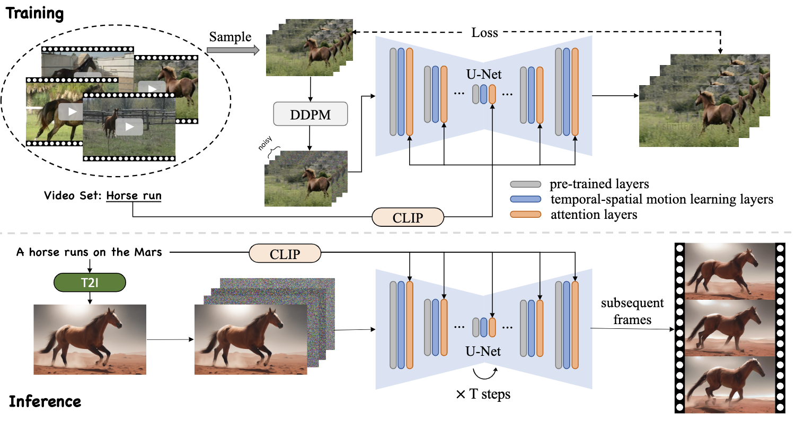
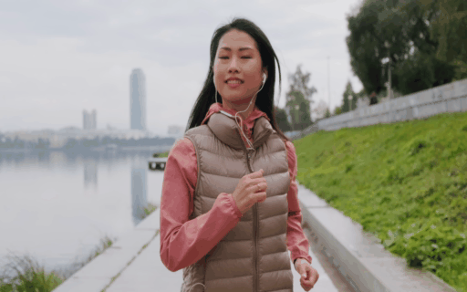

# <p align=center> :movie_camera: `LAMP: Learn A Motion Pattern by Few-Shot Tuning a Text-to-Image Diffusion Model`</p>

 

This repository is the official implementation of [LAMP]()

> **LAMP: Learn A Motion Pattern by Few-Shot Tuning a Text-to-Image Diffusion Model**<br>
> Ruiqi Wu, Linagyu Chen, Tong Yang, Chunle Guo, Chongyi Li, Xiangyu Zhang 
><br>( * indicates corresponding author)

[Arxiv Paper (TBD)]&nbsp;
[[Website Page](https://rq-wu.github.io/projects/LAMP/index.html)]&nbsp;
[Google Driver (TBD)] [Baidu Disk]&nbsp;
&nbsp;

:rocket: LAMP is a **few-shot-based** method for text-to-video generation. You only need **8~16 videos 1 GPU (> 15 GB VRAM)** for training!! Then you can generate videos with learned motion pattern.

## Preparation
### Dependencies and Installation
- Ubuntu > 18.04
- CUDA=11.3
- Others:

```bash
# clone the repo
git clone https://github.com/RQ-Wu/LAMP.git
cd LAMP

# create virtual environment
conda create -n LAMP python=3.8
conda activate LAMP

# install packages
pip install torch==1.12.1+cu113 torchvision==0.13.1+cu113 torchaudio==0.12.1 --extra-index-url https://download.pytorch.org/whl/cu113
pip install -r requirements.txt
pip install xformers==0.0.13
```

### Weights and Data
1. You can download pre-trained T2I diffusion models on hugging face.
In our work, we use [Stable Diffusion v1.4](https://huggingface.co/CompVis/stable-diffusion-v1-4) as our backbone network. Clone the pretrained weights by `git-lfs` and put them in `./checkpoints`

2. Our checkpoint and training data will be released soon, you can also collected video data by your own (Suggest websites: [pexels](https://pexels.com/), [forzen-in-time](https://meru.robots.ox.ac.uk/frozen-in-time/)) and put .mp4 files in `./videos/[motion_name]/`

## Get Started
1. Training to learn a motion pattern
```bash
CUDA_VISIBLE_DEVICES=X accelerate launch train_lamp.py config="configs/XXX.yaml"
```

2. Inference
```bash
TBD
```


## Visual Examples
### Few-Shot-Based Text-to-Video Generation
<table class="center">
    <tr>
        <td align="center" style="width: 7%"> Horse run</td>
        <td align="center">
            
        </td>
        <td align="center">
            
        </td>
        <td align="center">
            
        </td>
    </tr>
    <tr class="prompt-row">
        <td align="center" style="width: 7%"> </td>
        <td align="center">A horse runs in the universe.</td>
        <td align="center">A horse runs on the Mars.</td>
        <td align="center">A horse runs on the road.</td>
    </tr>
    <tr>
        <td align="center" style="width: 7%"> Firework</td>
        <td align="center">
            
        </td>
        <td align="center">
            
        </td>
        <td align="center">
            
        </td>
    </tr>
    <tr class="prompt-row">
        <td align="center" style="width: 7%"> </td>
        <td align="center">Fireworks in desert night.</td>
        <td align="center">Fireworks over the mountains.</td>
        <td align="center">Fireworks in the night city.</td>
    </tr>
    <tr>
        <td align="center" style="width: 7%"> Play the guitar</td>
        <td align="center">
            
        </td>
        <td align="center">
            
        </td>
        <td align="center">
            
        </td>
    </tr>
    <tr class="prompt-row">
        <td align="center" style="width: 7%"> </td>
        <td align="center">GTA5 poster, a man plays the guitar.</td>
        <td align="center">A woman plays the guitar.</td>
        <td align="center">An astronaut plays the guitar, photorelastic.</td>
    </tr>
    <tr>
        <td align="center" style="width: 7%"> Birds fly</td>
        <td align="center">
            
        </td>
        <td align="center">
            
        </td>
        <td align="center">
            
        </td>
    </tr>
    <tr class="prompt-row">
        <td align="center" style="width: 7%"></td>
        <td align="center">Birds fly in the pink sky.</td>
        <td align="center">Birds fly in the sky, over the sea.</td>
        <td align="center">Many Birds fly over a plaza.</td>
    </tr>
<table>

### Video Editing
<table style="width: 100%;">
    <tbody>
        <tr class="prompt-row">
            <td align="center"> Origin Videos </td>
            <td align="center"> Editing Result-1</td>
            <td align="center"> Editing Result-2</td>
        </tr>
        <tr class="result-row">
            <td align="center">
                
            </td>
            <td align="center">
                
            </td>
            <td align="center">
                
            </td>
        </tr>
        <tr class="prompt-row">
            <td align="center"></td>
            <td align="center">A girl in black runs on the road.</td>
            <td align="center">A man runs on the road.</td>
        </tr>
        <tr class="result-row">
            <td align="center">
                
            </td>
            <td align="center">
                
            </td>
            <td align="center">
                
            </td>
        </tr>
        <tr class="prompt-row">
            <td align="center"></td>
            <td align="center">A man is dancing.</td>
            <td align="center">A girl in white is dancing.</td>
        </tr>
    </tbody>
</table>

## Citation
If you find our repo useful for your research, please cite us:
```
@artical{wu2023lamp,
    title={LAMP: Learn a Motion Pattern by Few-Shot Tuning a Text-to-Image Diffusion Model},
    author={Wu, Ruiqi and Chen, Liangyu and Yang, Tong and Guo, Chunle and Li, Chongyi and Zhang, Xiangyu},
    journal={arXiv preprint arXiv:XXXX},
    year={2023}
}
```

## License
Licensed under a [Creative Commons Attribution-NonCommercial 4.0 International](https://creativecommons.org/licenses/by-nc/4.0/) for Non-commercial use only.
Any commercial use should get formal permission first.

## Acknowledgement
This repository is maintained by [Ruiqi Wu](https://rq-wu.github.io/).
The code is built based on [Tune-A-Video](https://github.com/showlab/Tune-A-Video). Thanks for the excellent open-source code!!
